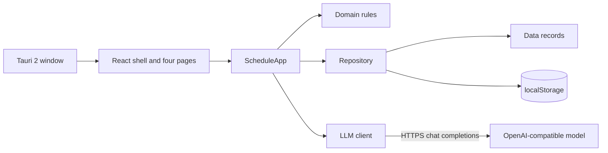

<p align="center">
  <picture>
    <source media="(prefers-color-scheme: dark)" srcset="docs/assets/logo-banner-dark.svg" />
    
  </picture>
</p>

<p align="center">
  <strong>Run yourself like a company.</strong><br/>
  A local-first daily planner with an idea DAG and an AI daily review.
</p>

<p align="center">
  <a href="README.zh-CN.md">简体中文</a> · English
</p>

<p align="center">
  <a href="https://github.com/lintaojlu/CEOS/stargazers"></a>
  <a href="LICENSE"></a>
  
  
  
</p>

<p align="center">
  <a href="#why-ceos">Why</a> ·
  <a href="#features">Features</a> ·
  <a href="#demo">Demo</a> ·
  <a href="#quick-start">Quick start</a> ·
  <a href="#architecture">Architecture</a> ·
  <a href="#how-it-works">How it works</a>
</p>

<p align="center">
  
</p>

## Why CEOS

Most to-do apps mix yesterday's leftovers into today, and good ideas disappear into a flat list. CEOS keeps each day self-contained, parks ideas in a dependency graph until they are ready, and writes the day's review for you. Your data stays on your machine.

## Features

- **A clean slate each day.** Required and optional tasks belong to one date. Nothing carries over unless you copy it.
- **An idea DAG.** Ideas live in one global graph. Give an idea a predecessor or a date, and it surfaces when both are satisfied.
- **Projects and milestones.** A project task and its daily copy share one id. Checking either one, or editing the title, note, or subtasks, updates both the project and the day you are viewing. Milestones sit on a single timeline.
- **An AI daily review and four insights.** Turn the day's tasks into a report, and ask the model for a short read on completion, rhythm, projects, and ideas.
- **A home dashboard.** A daily quote, milestones, the report, insights, and a year of activity shown as a heatmap.
- **Local-first.** Everything is stored in `localStorage`. The network is used only when you generate a report or insights, and the app calls the model directly.

## Demo

**Daily tasks.** Required and optional lists for one date, with progress, subtasks, and recurrence.

<p align="center">
  
</p>

**Idea graph.** Every idea on one canvas. Drag between handles to set a predecessor, and pick an idea up into today once it is ready.

<p align="center">
  
</p>

**Projects.** Projects are global. Adding a task from a project drops a copy into today's required list.

<p align="center">
  
</p>

**AI daily review.** A report generated from the day's tasks and notes.

<p align="center">
  
</p>

**Activity.** Active days, the current streak, the longest streak, and a heatmap of how much of each day's required list got done.

<p align="center">
  
</p>

## Quick start

```bash
npm install
npm run dev        # http://localhost:5173/ceo-schedule.html
npm run desktop    # desktop window, requires Rust
```

<details>
<summary>Optional: AI review</summary>

Open Settings in the sidebar and fill in the model endpoint, model id, and API key. They stay in this machine's `localStorage`. The default endpoint is Volcengine Ark (`https://ark.cn-beijing.volces.com/api/v3`). Use Test connection before generating a report or insights.

</details>

## Architecture



| Layer | Responsibility |
|---|---|
| `src/ui/` | Sidebar, pages, and the React Flow idea canvas |
| `src/application/` | Use cases, events, and the composition root |
| `src/domain/` | Pure rules: readiness, sync, stats, calendar, prompts |
| `src/data/` | Shape of a day's record and the global workspace |
| `src/infrastructure/` | `localStorage`, schema migration, and the model client |

## How it works

Tasks are scoped to a day. Ideas, projects, and milestones are global and never move when you change the date.

| | Where it lives | Moves with the date |
|---|---|---|
| Required and optional tasks, notes, AI review | `ceoSchedule[date]` | Yes, one record per day |
| Ideas, projects, milestones | `ceoWorkspace` | No, one global copy |

**Sync tasks** copies the unfinished required and optional tasks from a day you choose into the day you are viewing. It keeps their original ids. Completed tasks are skipped, and the source day cannot be the day you are viewing.

An idea becomes ready when it is unfinished, every predecessor is done, and its date is today or earlier. Predecessors can be any idea, or an unfinished task from the day you are viewing.

## Tech stack

A React app on Vite, with [React Flow](https://reactflow.dev) for the idea canvas, [Tauri 2](https://tauri.app) for the desktop window, and Vitest for the domain rules. Reports and insights call an OpenAI-compatible model, such as [Volcengine Ark](https://www.volcengine.com/product/ark), directly from the app.

## Details

<details>
<summary>Project layout</summary>

```text
ceo-schedule.html          shell page
src/
  main.jsx                 bootstrap
  data/                    record shapes
  domain/                  day, idea DAG, stats, calendar, prompts
  application/             schedule, ideas, insights, report, transfer
  infrastructure/          repository, migration, model client
  ui/                      sidebar, four pages, idea canvas
src-tauri/                 Tauri 2 shell
```

</details>

<details>
<summary>Storage keys</summary>

| Key | Holds |
|---|---|
| `ceoSchedule` | Per day: required tasks, optional tasks, notes, AI review |
| `ceoWorkspace` | Global: ideas, milestones, projects |
| `ceoSchemaVersion` | Schema version. v4 is the global workspace |
| `ceoLlmSettings` | Model endpoint, model id, and API key |
| `ceoInsights` | Cached insight text, by day |
| `ceoUiPrefs` | Last page, idea view, calendar scale |

</details>

<details>
<summary>Data and privacy</summary>

Data stays in `localStorage` on your machine. A report or an insight is the only request that leaves the machine, and it goes straight to the model endpoint you configured. Export a JSON backup from Settings whenever you want a copy.

</details>

<details>
<summary>FAQ</summary>

**The page is blank.** Open it through `npm run dev` or `npm run desktop`. The modules need the dev server, so opening the file directly will not work.

**My data disappeared.** Storage is separated by protocol, host, and port. Always use `http://localhost:5173`. The desktop window uses its own storage, separate from your browser. Move data between them with the JSON export.

**The AI review does nothing.** Open Settings, fill in the model id and API key, and use Test connection.

</details>

## Contributing

Issues and pull requests are welcome. If CEOS is useful to you, consider starring it so others can find it.

## Star history

<p align="center">
  <picture>
    <source media="(prefers-color-scheme: dark)" srcset="https://api.star-history.com/svg?repos=lintaojlu/CEOS&type=Date&theme=dark" />
    
  </picture>
</p>

## License

[MIT](LICENSE)
