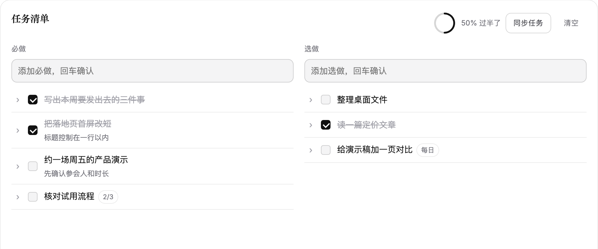
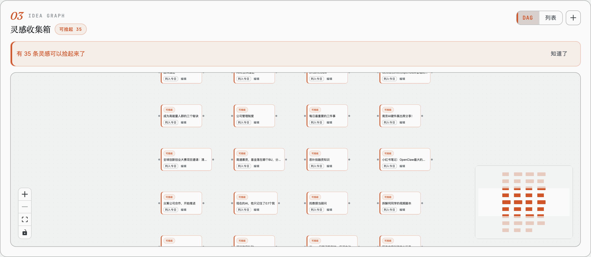
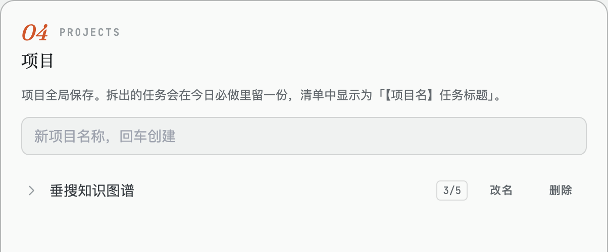
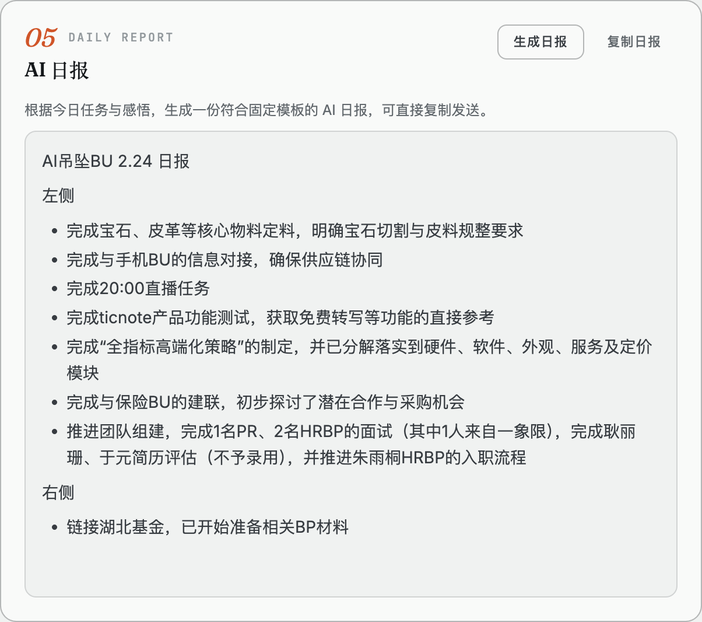
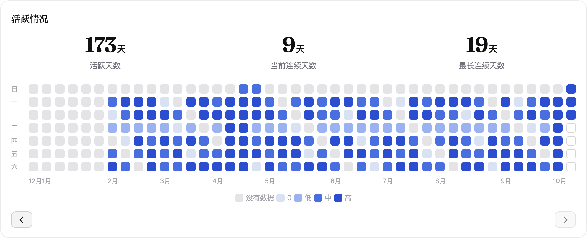
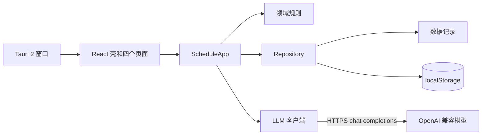

<p align="center">
  <picture>
    <source media="(prefers-color-scheme: dark)" srcset="docs/assets/logo-banner-dark.svg" />
    
  </picture>
</p>

<p align="center">
  <strong>像运营公司一样运营自己。</strong><br/>
  按日清的任务、灵感 DAG、AI 日报，数据只存在本机。
</p>

<p align="center">
  简体中文 · <a href="README.md">English</a>
</p>

<p align="center">
  <a href="https://github.com/lintaojlu/CEOS/stargazers"></a>
  <a href="LICENSE"></a>
  
  
  
</p>

<p align="center">
  <a href="#为什么做-ceos">为什么做</a> ·
  <a href="#功能">功能</a> ·
  <a href="#演示">演示</a> ·
  <a href="#快速开始">快速开始</a> ·
  <a href="#架构">架构</a> ·
  <a href="#它怎么工作">它怎么工作</a>
</p>

<p align="center">
  
</p>

## 为什么做 CEOS

多数待办会把昨天没做完的事混进今天，好想法则掉进一个扁平列表里。CEOS 让每一天自成一体，把灵感放进一张依赖图，等它就绪再浮出来，并替你写好当天的复盘。数据留在你自己的机器上。

## 功能

- **每天一张白纸。** 必做和选做只属于一个日期，除非你主动拷贝，否则不会带入下一天。
- **灵感 DAG。** 所有灵感在同一张全局图上。给一条灵感设前序或日期，两者都满足时它才变成就绪。
- **项目和里程碑。** 项目任务和它的当日副本共用一个 id。勾选，或修改标题、备注、子任务，都会同时改项目和当前查看日。里程碑放在同一条时间轴上。
- **AI 日报和四条洞察。** 把当天任务整理成日报，并让模型简短解读完成率、节奏、项目和灵感。
- **首页。** 每日格言、里程碑、日报、洞察，以及用热力图呈现的一年活跃情况。
- **本地优先。** 全部存在 `localStorage`。只有生成日报或洞察时才联网，并由应用直接调用模型。

## 演示

**每日任务。** 一天的必做和选做，带进度、子任务和周期。

<p align="center">
  
</p>

**灵感图。** 所有灵感在一张画布上。从一个节点的手柄拖到另一个节点就是设置前序，就绪后可以列入今天。

<p align="center">
  
</p>

**项目。** 项目全局保存。从项目添加任务时，会在今天的必做里留一份副本。

<p align="center">
  
</p>

**AI 日报。** 根据当天的任务和感悟生成的日报。

<p align="center">
  
</p>

**活跃情况。** 活跃天数、当前连续天数、最长连续天数，以及按每天必做完成率着色的热力图。

<p align="center">
  
</p>

## 快速开始

```bash
npm install
npm run dev        # http://localhost:5173/ceo-schedule.html
npm run desktop    # 桌面窗口，需要 Rust
```

<details>
<summary>可选：AI 日报</summary>

在侧边栏打开「设置」，填写模型地址、模型 ID 和 API Key。它们只留在这台机器的 `localStorage`。默认地址是火山引擎 Ark（`https://ark.cn-beijing.volces.com/api/v3`）。生成日报或洞察前，可以先点「测试连接」。

</details>

## 架构



| 层 | 职责 |
|---|---|
| `src/ui/` | 侧边栏、四个页面，以及 React Flow 灵感画布 |
| `src/application/` | 用例、事件和组合根 |
| `src/domain/` | 纯规则：就绪、同步、统计、日历、提示词 |
| `src/data/` | 一天的记录和全局 workspace 的形状 |
| `src/infrastructure/` | `localStorage`、schema 迁移和模型客户端 |

## 它怎么工作

任务按日隔离。灵感、项目、里程碑全局各一份，切换日期时不会跟着动。

| | 存在哪里 | 会随日期变化 |
|---|---|---|
| 必做、选做、感悟、AI 日报 | `ceoSchedule[日期]` | 会，一天一份 |
| 灵感、项目、里程碑 | `ceoWorkspace` | 不会，全局一份 |

**同步任务**把你选定的某一天里未完成的必做和选做拷贝到当前查看日，并保留原来的任务 id。已完成的不拷，来源日不能是当前查看日。

一条灵感在同时满足三点时变成就绪：尚未完成、所有前序都已完成、日期是今天或更早。前序可以是任意灵感，或当前查看日里未完成的任务。

## 技术栈

Vite 上的 React 应用，用 [React Flow](https://reactflow.dev) 做灵感画布，用 [Tauri 2](https://tauri.app) 做桌面窗口，用 Vitest 测试领域规则。日报和洞察从应用里直接调用 OpenAI 兼容接口，例如[火山引擎 Ark](https://www.volcengine.com/product/ark)。

## 更多细节

<details>
<summary>项目结构</summary>

```text
ceo-schedule.html          页面壳
src/
  main.jsx                 启动入口
  data/                    记录形状
  domain/                  日程、灵感 DAG、统计、日历、提示词
  application/             日程、灵感、洞察、日报、任务移动
  infrastructure/          Repository、迁移、模型客户端
  ui/                      侧边栏、四个页面、灵感画布
src-tauri/                 Tauri 2 桌面壳
```

</details>

<details>
<summary>存储键</summary>

| 键 | 内容 |
|---|---|
| `ceoSchedule` | 按日：必做、选做、感悟、AI 日报 |
| `ceoWorkspace` | 全局：灵感、里程碑、项目 |
| `ceoSchemaVersion` | schema 版本，v4 即全局 workspace |
| `ceoLlmSettings` | 模型地址、模型 ID、API Key |
| `ceoInsights` | 按日缓存的洞察文本 |
| `ceoUiPrefs` | 上次打开的页面、灵感视图、日历粒度 |

</details>

<details>
<summary>数据与隐私</summary>

数据存在你机器上的 `localStorage` 里。唯一会离开本机的请求是日报或洞察，它直接发往你在设置里填写的模型地址。想留一份副本时，在设置里导出 JSON。

</details>

<details>
<summary>常见问题</summary>

**页面是空白的。** 用 `npm run dev` 或 `npm run desktop` 打开。模块依赖开发服务器，直接双击文件打不开。

**数据好像丢了。** 存储按协议、主机和端口分开。请始终使用 `http://localhost:5173`。桌面窗口用的是它自己的存储，和浏览器不是同一份。两边互搬数据用 JSON 导出。

**AI 日报没有反应。** 打开设置，填写模型 ID 和 API Key，再点测试连接。

</details>

## 参与贡献

欢迎提 Issue 和 Pull Request。如果 CEOS 对你有用，点个 Star 让更多人看到它。

## Star 增长

<p align="center">
  <picture>
    <source media="(prefers-color-scheme: dark)" srcset="https://api.star-history.com/svg?repos=lintaojlu/CEOS&type=Date&theme=dark" />
    
  </picture>
</p>

## 许可证

[MIT](LICENSE)
